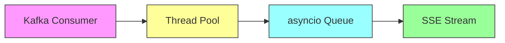
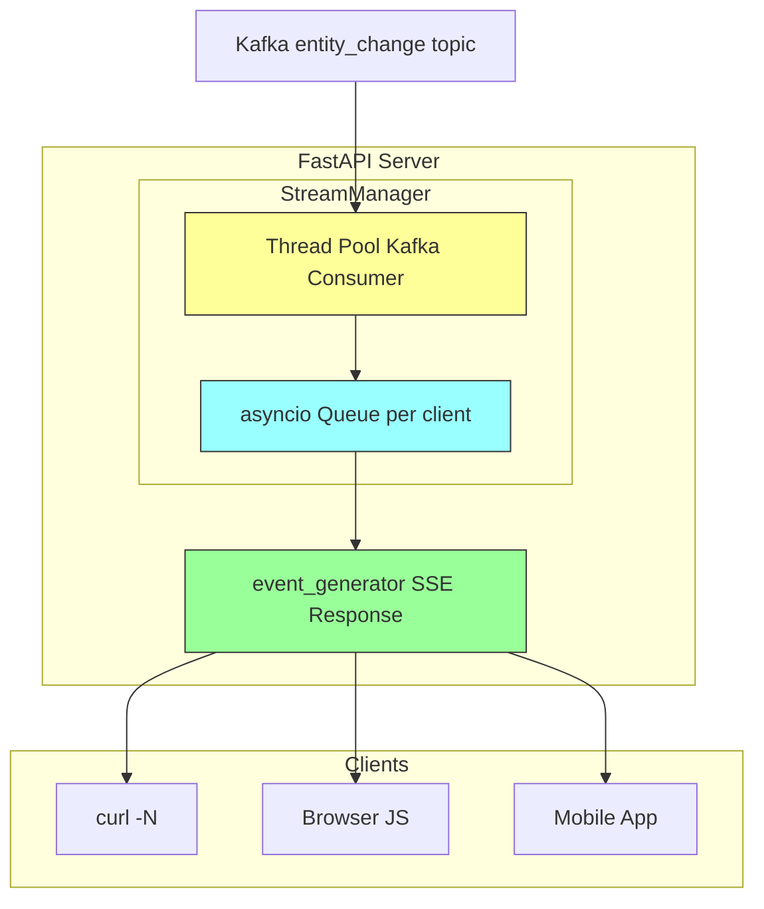
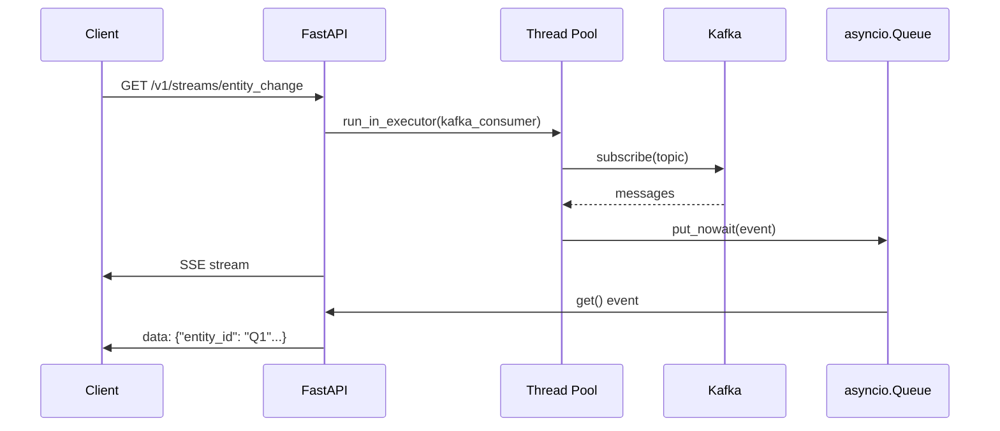

# kafka2sse-backend

[](https://codecov.io/gh/dpriskorn/kafka2sse-backend)

A high-performance streaming service that delivers Kafka messages to HTTP clients via Server-Sent Events (SSE). Built with Python, FastAPI, and confluent-kafka.

## Why kafka2sse?

Traditional Kafka consumers block when waiting for messages. This service solves that by running Kafka consumers in a thread pool, keeping your API responsive while streaming real-time events to thousands of connected clients.



## Features

- **Real-time streaming** - Events flow from Kafka to HTTP clients via SSE
- **Non-blocking** - Kafka consumer runs in thread pool, won't freeze your API
- **Shared state** - Uses Valkey (Redis alternative) for multi-worker coordination
- **Fan-out** - One Kafka consumer per topic, events broadcast to all subscribers
- **Flexible seeking** - Start from offset, timestamp, or latest
- **Backpressure** - Configurable queues with automatic drop-on-full for slow clients
- **Metadata API** - Query topic message counts in real-time

## Quick Start

```bash
# List available topics
curl http://localhost:8888/v1/topics
# {"topics":["entity_change","entity_diff"]}

# Stream events from a topic
curl -N http://localhost:8888/v1/streams/entity_change

# Stream from specific offset
curl -N "http://localhost:8888/v1/streams/entity_change?offset=0"

# Check message count
curl http://localhost:8888/v1/streams/entity_change/metadata
# {"topic":"entity_change","earliest_offset":0,"latest_offset":150,"message_count":150}
```

## API Endpoints

| Endpoint | Description |
|----------|-------------|
| `GET /v1/streams/{topic}` | Stream events via SSE |
| `GET /v1/streams/{topic}/metadata` | Get topic message count |
| `GET /v1/topics` | List available Kafka topics |
| `GET /health` | Health check |

## Query Parameters

| Parameter | Description | Example |
|-----------|-------------|---------|
| `offset` | Start from Kafka offset | `?offset=100` |
| `since` | Start from timestamp (ISO8601) | `?since=2026-03-09T12:00:00Z` |
| `limit` | Max events before close | `?limit=100` |

## Configuration

| Variable | Default | Description |
|----------|---------|-------------|
| `KAFKA_BROKERS` | `localhost:9092` | Kafka broker addresses |
| `VALKEY_HOST` | `localhost` | Valkey host for shared state |
| `VALKEY_PORT` | `6379` | Valkey port |
| `KAFKA_CLIENT_QUEUE_SIZE` | `100` | Max queue per client |
| `HOST` | `0.0.0.0` | Server bind address |
| `PORT` | `8888` | Server port |

## Architecture



### Data Flow



## Thread Pool Explained

The Kafka consumer's `poll()` is a **blocking call** - it waits until a message arrives. Running it directly in async code would freeze the entire server.

Solution: run the consumer in a thread pool:

```python
# Blocking consumer runs in separate thread
def kafka_consumer_thread():
    while True:
        msg = consumer.poll(timeout=1.0)  # BLOCKS here
        queue.put_nowait(msg)

# Non-blocking async code
async def event_generator():
    event = await queue.get()  # Doesn't block other requests
    yield event

# Start in thread pool, keep async event loop responsive
loop.run_in_executor(None, kafka_consumer_thread)
```

## Development

```bash
# Install dependencies
poetry install

# Run tests
poetry run pytest

# Run locally
poetry run python -m src.main

# Or with uvicorn
poetry run uvicorn src.main:app --reload
```

## Deployment

```bash
# Build Docker image
docker build -t kafka2sse-backend .

# Run with docker-compose (see entitybase-orchestrator)
```

## Related

- [FastAPI](https://fastapi.tiangolo.com/) - Web framework
- [confluent-kafka](https://github.com/confluentinc/confluent-kafka-python) - Kafka client
- [Valkey](https://valkey.io/) - Redis alternative
- [Server-Sent Events](https://developer.mozilla.org/en-US/docs/Web/API/Server-sent_events) - W3C standard
