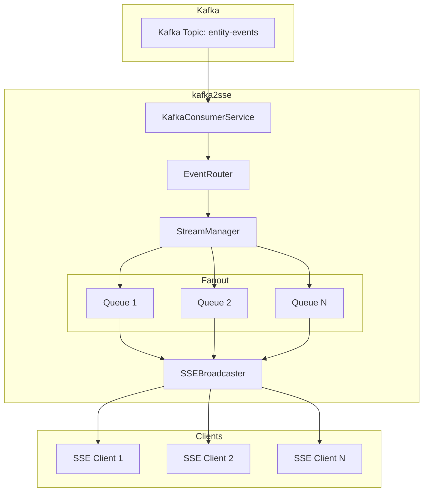

# kafka2sse-backend

A reusable Python service that streams Kafka messages to HTTP clients via Server-Sent Events (SSE).

## Description

A lightweight streaming API gateway that allows HTTP clients to subscribe to Kafka topics via Server-Sent Events (SSE) and receive events in real time.

## Architecture



## Features

- **Fan-out architecture**: One Kafka consumer per topic, events distributed to multiple SSE clients
- **Offset/timestamp-based seeking**: Start streaming from a specific offset or timestamp
- **Backpressure handling**: Configurable queue sizes with automatic event dropping for slow clients
- **Configurable limits**: Stream a maximum number of events before closing the connection

## API Endpoints

- `GET /v1/streams/{topic}` - Stream events from a Kafka topic via SSE
- `GET /v1/topics` - List active Kafka topics
- `GET /health` - Health check

## Query Parameters

- `offset` - Start streaming from a specific Kafka offset
- `since` - Start streaming from the first event with timestamp >= ISO8601 timestamp
- `limit` - Maximum number of events to stream before closing

## Example Requests

```
/v1/streams/entity-events
/v1/streams/entity-events?offset=12345
/v1/streams/entity-events?since=2026-03-05T12:00:00Z
/v1/streams/entity-events?offset=500&limit=100
/v1/streams/entity-events?since=2026-03-05T12:00:00Z&limit=200
```

## Configuration

Set environment variables:

- `KAFKA_BROKERS` - Kafka broker addresses (default: localhost:9092)
- `KAFKA_CLIENT_QUEUE_SIZE` - Max queue size per SSE client (default: 100)
- `HOST` - Server host (default: 0.0.0.0)
- `PORT` - Server port (default: 8888)

## Installation

```bash
poetry install
```

## Running

```bash
poetry run python -m src.main
```

Or with uvicorn:

```bash
poetry run uvicorn src.main:app --host 0.0.0.0 --port 8888
```
